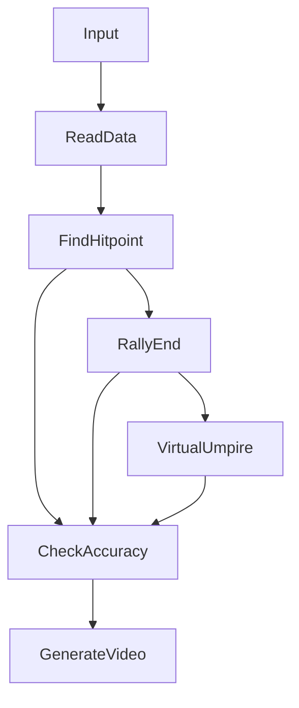

# Segmentation

## Usage

Input csv file,output a video that shows virtual umpire,hitpoint event and TrackNet's ball's position.

```
python3 segmentation.py
```

- Input csv format :
    |Frame|Visibility|X|Y|
    |:---:|:--------:|:---:|:---:|
    |1|0|0|0|
- Output virtual umpire video screenshot :
    

## Flow Chart

